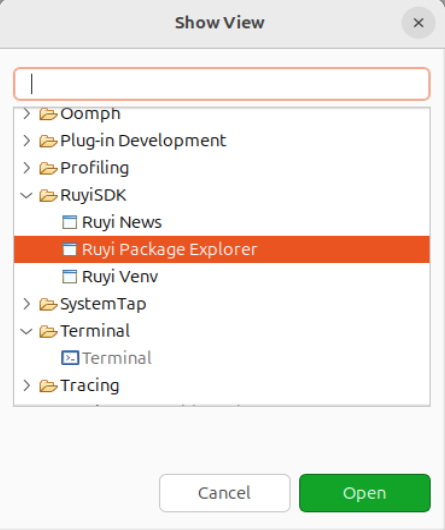
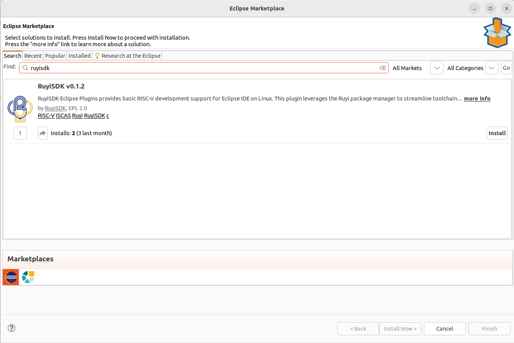

# 安装插件

## 操作步骤

1.使用 [ruyisdk-eclipse-plugins/releases](https://github.com/ruyisdk/ruyisdk-eclipse-plugins/releases) 提供的方法进行操作  
2.通过 Eclipse Marketplace 安装

## 预期结果

能够正常安装，无报错

## 测试结果

方式一：能够正常安装，无报错

方式二：通过 Eclipse Marketplace 安装，能够正常安装

