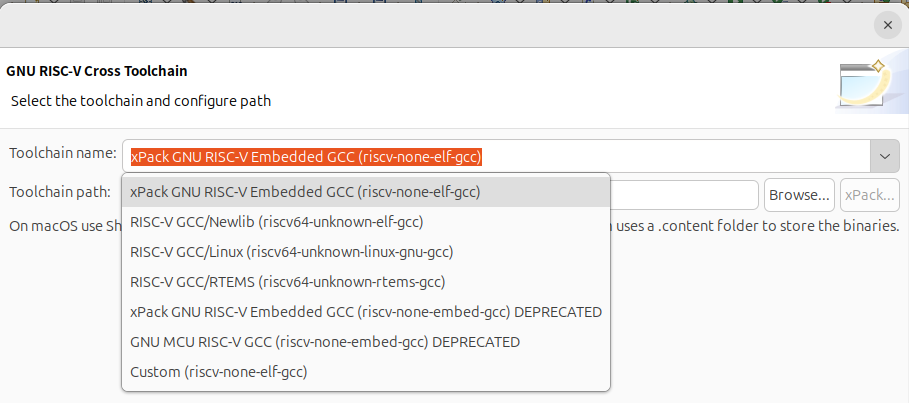
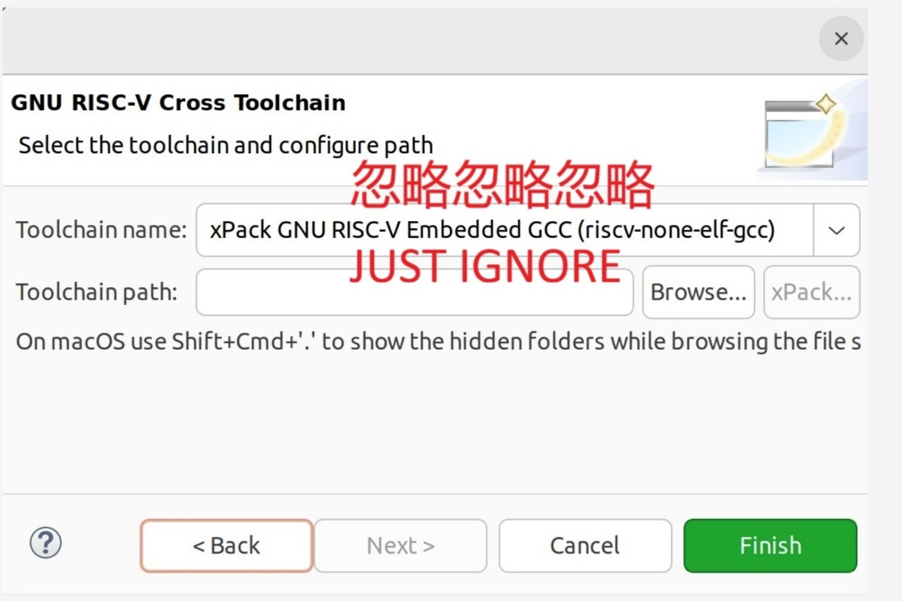
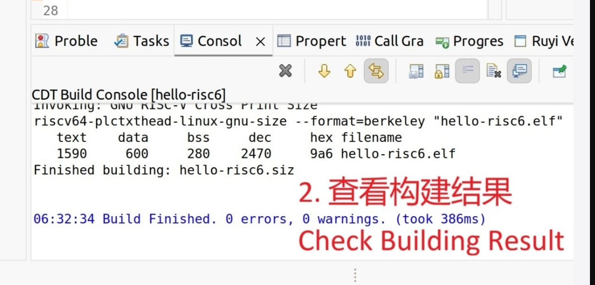

# GUI界面流程的QEMU调试

## 操作流程


## 预期结果
GUI界面流程的QEMU调试顺利

## 测试结果
存疑：



改为
报错信息
```
19:41:43 **** Build of configuration Debug for project hello2 ****
make all 
Building file: ../src/main.cpp
Invoking: GNU RISC-V Cross C++ Compiler
riscv-none-elf-g++ -msmall-data-limit=8 -mno-save-restore -O0 -fmessage-length=0 -fsigned-char -ffunction-sections -fdata-sections -g3 -std=gnu++11 -fabi-version=0 -MMD -MP -MF"src/main.d" -MT"src/main.o" -c -o "src/main.o" "../src/main.cpp"
/bin/sh: 行 1: riscv-none-elf-g++: 未找到命令
make: *** [src/subdir.mk:20：src/main.o] 错误 127
"make all" terminated with exit code 2. Build might be incomplete.

19:41:43 Build Failed. 1 errors, 0 warnings. (took 89ms)
```